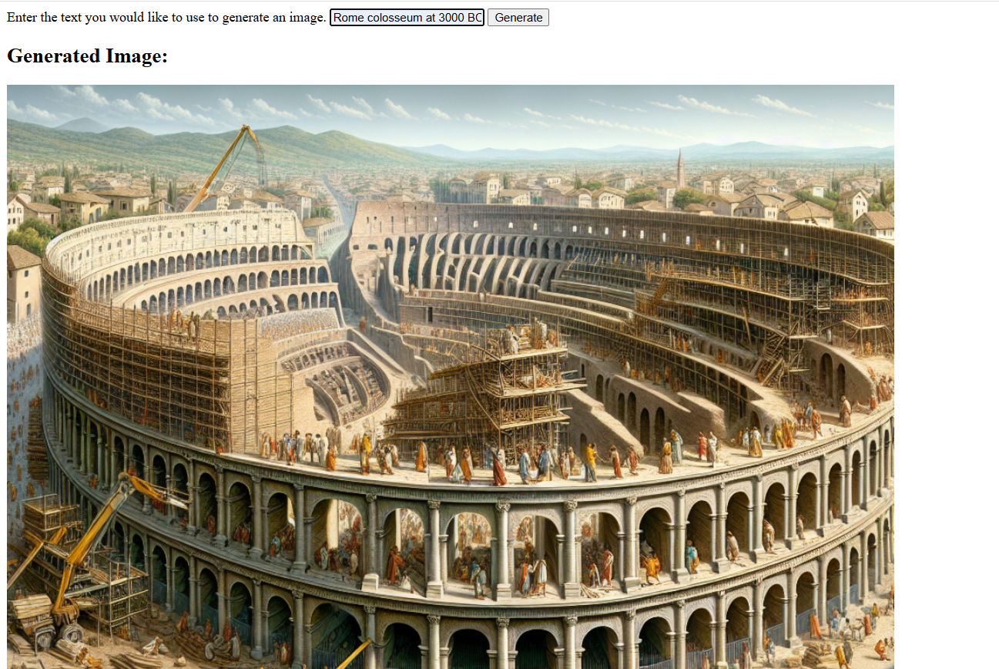

# Project Name: aimlapi generations

## What is aimlapi_generations? 
Flask framework project integrating Generative AI for images and videos.

## Inside environment you should install the below
<pre>
  pip install flask
  pip install requests
</pre>

Website documentation: https://docs.aimlapi.com/api-references/image-models/openai/dall-e-3

Tip: you have to create account for aimlapi and api key that you will use inside the project. Free plan you can generate 20 image per day only.

